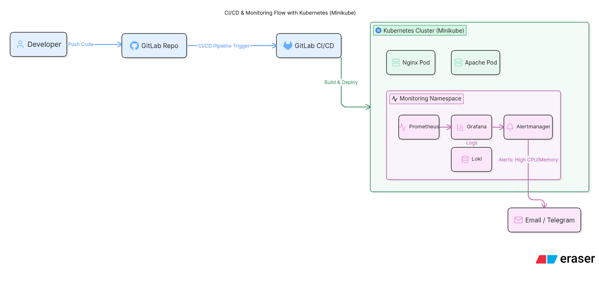

# Project Title

Kubernetes Monitoring Locally

# Architecture Overview

This project is designed around a local Kubernetes environment created
using Minikube. The architecture consists of three major layers:

1. Application Layer
2. Monitoring and Alerting Layer
3. CI/CD Automation Layer

The goal of the architecture is to simulate a real-world DevOps
infrastructure locally before migrating to cloud platforms such as AWS
EKS.

{width="17cm"
height="8.223cm"}

# Component Description

## 1. Kubernetes Cluster (Minikube)

The local Kubernetes cluster acts as the core infrastructure where all
applications and monitoring services are deployed.

Responsibilities:

-   Container orchestration
-   Pod management
-   Service networking
-   Resource management
-   Scaling deployments

# 2. Application Layer

### Nginx Deployment

A containerized Nginx application deployed as a Kubernetes Deployment
object.

Purpose:

-   Simulate frontend/web workload
-   Generate monitoring metrics

### Apache Deployment

A containerized Apache HTTP Server deployed inside Kubernetes.

Purpose:

-   Simulate additional application workload
-   Test monitoring and scaling

# 3. Monitoring Layer

### Prometheus

Prometheus continuously collects metrics from:

-   Kubernetes nodes
-   Pods
-   Containers
-   System resources

Metrics include:

-   CPU usage
-   Memory usage
-   Pod health
-   Restart counts

### Grafana

Grafana connects to Prometheus as a data source and visualizes collected
metrics using dashboards.

Dashboards display:

-   Cluster health
-   Pod performance
-   Resource utilization
-   Application monitoring

### Alertmanager

Alertmanager handles alerts generated by Prometheus.

Responsibilities:

-   Alert processing
-   Alert grouping
-   Sending notifications

Alert examples:

-   High CPU usage
-   High memory usage
-   Pod failures

## 4. CI/CD Layer

### GitLab Repository

Stores:

-   Kubernetes manifests
-   Monitoring configurations
-   CI/CD pipeline files
-   Documentation

### GitLab CI/CD Pipeline

The CI/CD pipeline automates:

1.  Code validation
2.  Docker image build
3.  Kubernetes deployment
4.  Update rollout

This enables continuous deployment into the Kubernetes cluster.

# Workflow Explanation

1.  Developer pushes code changes to GitLab
2.  GitLab CI/CD pipeline gets triggered
3.  Docker images are built automatically
4.  Kubernetes deployments are updated
5.  Prometheus collects metrics from running containers
6.  Grafana visualizes metrics in dashboards
7.  Alertmanager sends notifications when thresholds are exceeded
